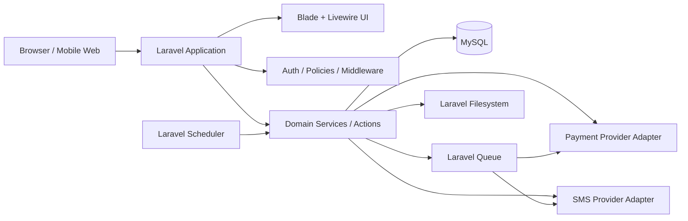

# Architecture — RentFlow

## Architectural Principles

- Laravel monolith first; avoid unnecessary distributed systems.
- Server-rendered web application with progressive interactivity through Livewire.
- Thin controllers and clear domain/application services.
- Provider-agnostic payments and notifications.
- Strong server-side authorization and validation.
- Financial state changes must be atomic, auditable and idempotent where applicable.
- Slow/retryable external work belongs in queues/jobs.
- Recurring billing/reminders/lease checks use Laravel Scheduler.
- Tanzania-first domain: TZS, Tanzanian phone numbers, mobile money, English/Kiswahili.
- Mobile-first and low-bandwidth aware.

## Canonical Architecture

RentFlow is planned as a Laravel monolith using Blade, Livewire, Tailwind CSS, MySQL and Eloquent.



## Planned Application Layers

```text
HTTP / Presentation
  Controllers
  Livewire components
  Blade views
  Form Requests

Application / Domain
  Actions
  Services
  domain rules
  state transitions

Infrastructure
  Eloquent models
  payment providers
  SMS providers
  filesystem
  queues
  external APIs

Persistence
  MySQL
  migrations
  audit/event records
```

Business rules must not live primarily in controllers, Blade templates or Livewire presentation methods.

## Planned Laravel Structure

```text
app/
  Actions/
  Domain/
  Http/
    Controllers/
    Middleware/
    Requests/
  Jobs/
  Livewire/
  Models/
  Notifications/
  Policies/
  Providers/
  Services/
    Payments/
    SMS/
    Billing/
    Tenancies/
    Maintenance/
config/
database/
  factories/
  migrations/
  seeders/
resources/
  views/
  css/
  js/
routes/
  web.php
  api.php
tests/
  Feature/
  Unit/
```

Create directories only when real implementation requires them.

## Routing Strategy

Primary browser routes should use `routes/web.php` and standard Laravel session authentication.

Planned route areas:

- public landing/information pages;
- authentication;
- landlord dashboard;
- tenant dashboard;
- property-manager dashboard;
- account/settings;
- payment callbacks/webhooks;
- optional external/mobile API routes later.

Use named routes and route model binding where appropriate.

## Authentication

Use Laravel's authentication facilities, with an appropriate starter/authentication stack chosen during bootstrap.

Requirements:

- secure password hashing;
- session-based browser authentication;
- role/profile persistence;
- verified server-side identity before protected operations;
- future API authentication may use Sanctum if an API/mobile client is introduced.

Do not introduce token-based authentication for the browser merely because it is fashionable.

## Authorization

Authorization must be enforced server-side through:

- Policies;
- Gates where appropriate;
- middleware for broad role boundaries;
- ownership/assignment checks at the resource level.

Examples:

- a landlord may access only properties they own or are authorized to manage;
- a tenant may access only their own tenancy records;
- a property manager receives explicit delegated scope;
- administrator privileges must remain auditable.

UI visibility is not an authorization mechanism.

## Validation

Use Laravel Form Requests or reusable validation rules for external input. Validation should cover:

- Tanzanian phone formats;
- TZS monetary values;
- dates and lease periods;
- uploaded file types/sizes;
- payment callback fields;
- state transition prerequisites.

## Domain Services

Important business workflows should be represented through Actions/Services rather than oversized controllers or models.

Examples:

- `CreateTenancy`
- `GenerateRentInvoice`
- `AllocatePayment`
- `ReconcilePaymentWebhook`
- `IssueReceipt`
- `SendRentReminder`
- `TransitionMaintenanceStatus`
- `CloseTenancy`

Names are illustrative; use the simplest organization that remains maintainable.

## Rent and Billing Architecture

Invoice generation must be independent from payment recording.

Laravel Scheduler should trigger recurring billing jobs, while domain logic determines which active tenancies require new invoices.

Important requirements:

- prevent duplicate invoices for the same tenancy/period;
- support partial payments;
- track balance independently from status labels;
- perform allocation/state transitions transactionally;
- keep historical records rather than destructively replacing them.

## Payment Architecture

Payment integrations must sit behind a provider interface/service boundary.

Conceptual interface responsibilities:

- initiate collection/payment request;
- retrieve/normalize provider status where needed;
- verify webhook authenticity;
- normalize callbacks into RentFlow payment events.

Provider-specific references must be stored separately from internal RentFlow identifiers.

Webhook handling must:

1. authenticate/verify the callback where supported;
2. validate references, currency and amount;
3. detect duplicate events/idempotency keys;
4. execute reconciliation inside an appropriate database transaction;
5. persist processing/audit evidence;
6. dispatch receipt/notification work after successful reconciliation.

## SMS / Notification Architecture

Use Laravel Notifications and/or a dedicated SMS service adapter.

Africa's Talking is the intended SMS provider target, but application logic should depend on an internal interface rather than provider-specific calls scattered through controllers.

SMS-worthy events include:

- tenant invitation;
- agreement sent/accepted;
- upcoming rent reminder;
- overdue notice;
- payment received;
- receipt issued;
- maintenance updates;
- lease-expiry warning.

SMS sending should normally be queued. An SMS outage should not roll back a successful financial transaction.

## Queues and Jobs

Queues should be used for slow, external or retryable tasks, including:

- SMS delivery;
- receipt/PDF generation where expensive;
- scheduled reminders;
- selected provider synchronization;
- non-critical analytics aggregation.

Queue jobs must be safe to retry where practical.

## Scheduler

Laravel Scheduler should coordinate recurring tasks such as:

- monthly rent invoice generation;
- due-soon reminder scans;
- overdue status processing;
- lease-expiry notifications;
- stale maintenance escalation where implemented.

Business rules remain in services/actions; scheduler commands/jobs should orchestrate them.

## Database

Default database: MySQL 8+.

Use:

- Laravel migrations;
- foreign-key constraints;
- indexes on common lookup/filter columns;
- decimal/integer-safe money representation rather than floats;
- timestamps/audit rows for material events;
- transactions for multi-record financial state changes.

See `DATABASE_SCHEMA.md`.

## File Storage

Use Laravel Filesystem. Local private storage is acceptable for development; production may use S3-compatible/private object storage.

Potential files:

- rental agreement PDFs;
- payment receipts;
- maintenance attachments;
- inspection evidence.

Files containing tenancy information must not be exposed through predictable public URLs.

## API Strategy

RentFlow is web-first. Do not build a large REST API before a real consumer exists.

`routes/api.php` is appropriate for:

- payment-provider callbacks/webhooks;
- SMS/provider callbacks where applicable;
- future mobile/external integrations.

If a native/mobile client is later introduced, versioned APIs and Laravel Sanctum may be added deliberately.

## Localization

Use Laravel localization resources from the beginning for user-facing copy where practical.

Target locales:

- English (`en` / Tanzania-aware formatting);
- Kiswahili (`sw`).

Do not mix translation text with business rules.

## Error Handling

- validation failures: standard Laravel validation responses;
- unauthenticated: redirect or 401 depending on surface;
- unauthorized: 403 without unnecessary data leakage;
- provider errors: normalize into application-level errors;
- retry external operations only when safe;
- never expose provider credentials/internal stack traces to end users.

## Observability

Use structured Laravel logging around:

- payment requests and reconciliation;
- webhook processing;
- SMS failures;
- scheduled jobs;
- queue failures;
- authorization-sensitive errors.

Use correlation/internal transaction identifiers for financial workflows where practical.

Do not log passwords, API secrets, OTPs or unnecessary personal data.

## Deployment Direction

The architecture must work on conventional Laravel hosting and should also support VPS/container deployment if needed.

Expected production components:

- PHP application runtime;
- Nginx/Apache or managed Laravel hosting;
- MySQL;
- queue worker;
- scheduler/cron;
- private file storage;
- HTTPS;
- environment-based secrets.

See `DEPLOYMENT.md`.

## Scalability

Start as one Laravel application. Scale vertically and optimize database/query patterns before considering service decomposition.

Important early practices:

- eager loading to avoid N+1 queries;
- pagination;
- database indexes;
- queued external work;
- idempotent scheduled jobs;
- caching only where measured needs justify it.

Do not introduce microservices for the FYP without a demonstrated constraint.
