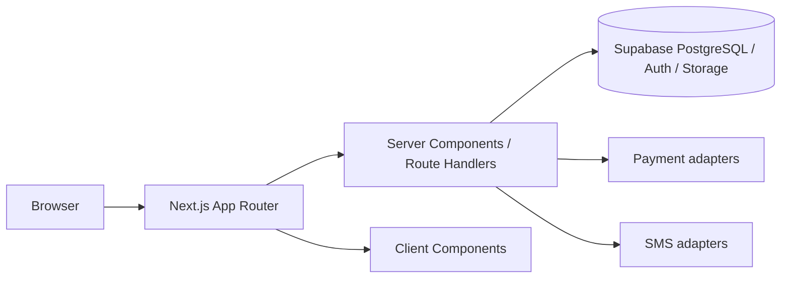

# Architecture — RentFlow

## Architectural principles

- One web application, not a microservice fleet
- App Router with server-first data access
- Domain types and adapters isolated from UI
- Provider-agnostic payments and notifications
- Secrets stay on the server
- Honest placeholders until a provider is wired
- Tanzania-first domain (TZS, phones, mobile money)

## Next.js architecture

RentFlow is a Next.js App Router application with TypeScript and Tailwind CSS. Source lives in `src/`.



## App Router strategy

Planned route groups:

- `(public)` — marketing and unauthenticated pages
- `(auth)` — login / register
- `(landlord)` — landlord dashboard
- `(tenant)` — tenant dashboard
- `api/` — webhooks and server endpoints that must not be RSC pages

Planned URLs (not all implemented in Phase 0):

- `/`, `/login`, `/register`
- `/landlord`, `/landlord/properties`, `/landlord/properties/[propertyId]`, `/landlord/tenants`, `/landlord/agreements`, `/landlord/payments`, `/landlord/maintenance`, `/landlord/settings`
- `/tenant`, `/tenant/agreement`, `/tenant/payments`, `/tenant/maintenance`, `/tenant/history`, `/tenant/profile`

## Server / client component boundaries

Default to Server Components. Use Client Components for forms, toasts, and interactive filters. Fetch tenancy, invoice, and payment data on the server. Never import service-role keys into client modules.

## Supabase integration

Planned: `@supabase/ssr` (or current recommended helpers) for cookie-based sessions, anon key in `NEXT_PUBLIC_*`, service role only in server-only modules. Phase 0 exposes `src/lib/supabase/config.ts` without a live client.

## Authentication strategy

Supabase Auth for email and, later, phone OTP if justified. Role stored on `profiles`, not duplicated user tables. Middleware or layout guards will restrict `/landlord` and `/tenant` once auth exists.

## Authorization strategy

- Application checks: session user must own or belong to the resource.
- Database checks: RLS on every tenant-owned table before production.
- Webhooks authenticate via signatures, not by trusting payload identity fields.

## Domain / service boundaries

```text
UI (app, components)
  → feature modules (when implemented)
    → lib adapters (payments, notifications, supabase)
      → external providers
```

Business rules (invoice balances, status transitions) must not be copied into React components.

## Payment abstraction

`src/lib/payments/types.ts` defines `PaymentProvider`. The first concrete adapter should be a sandbox simulator. Live operators implement the same interface. Store provider transaction IDs separately from internal payment IDs.

## Notifications abstraction

`src/lib/notifications/types.ts` defines SMS sending. Africa's Talking is the planned production SMS adapter. A console/sandbox adapter is acceptable for demo.

## Document generation

Agreements and receipts should later render as HTML and optionally PDF. Unique IDs and optional QR verification are post-MVP. Legal validity is a production requirement, not an automatic claim.

## Storage

Supabase Storage for maintenance evidence and agreement PDFs. Validate file type and size server-side. Private buckets; signed URLs.

## Auditing

`rental_history_events` (planned) records major tenancy events. Status tables for maintenance and payments keep historical rows rather than overwriting without trace.

## Deployment

GitHub → Vercel. `main` is production. Preview deployments may use `masterchanges`. Environment variables are set in Vercel, not in git.

## Observability

Use platform logs first. Add structured logging around payments and webhooks. Error UI should be generic to users; details stay in logs.

## Error handling

- Validation errors: 400 with field messages
- Authz errors: 401/403 without leaking existence where inappropriate
- Provider errors: map to stable application errors; retry idempotently where safe

## Environment separation

Local (`.env.local`), preview, production. Never share production service-role keys with preview.

## Scalability considerations

Postgres indexes on foreign keys and due dates; paginated lists; avoid N+1 queries; queue SMS later if volume requires it. Do not introduce a second backend unless a concrete constraint appears.
