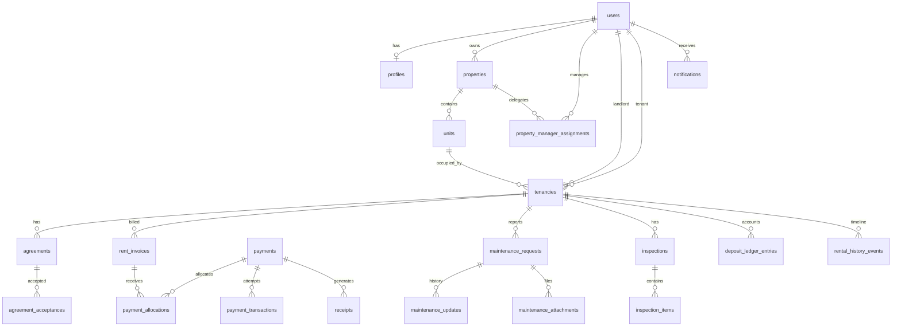

# Database Schema — RentFlow

This document defines the **planned relational model** for the Laravel implementation. No production schema has been migrated yet.

Default database: **MySQL 8+**.

All schema changes must be implemented through Laravel migrations in `database/migrations/` once the Laravel application is initialized.

## Design Principles

- use relational integrity and foreign keys;
- use Laravel migrations for every schema change;
- use Eloquent relationships deliberately;
- keep invoices separate from payments;
- support partial payments through explicit allocations;
- preserve financial/audit history;
- use transactions around atomic financial state changes;
- do not use floating-point columns for money;
- index frequent foreign keys, dates, status fields and provider references;
- keep authorization in Laravel Policies/Gates/middleware plus resource ownership/assignment rules.

## Entity Overview



## users

Use Laravel's standard users table as the authentication identity base.

Suggested columns:

- `id`
- `name`
- `email` nullable/unique as required
- `phone` nullable/unique as required
- `email_verified_at` nullable
- `phone_verified_at` nullable
- `password`
- `remember_token`
- timestamps

Authentication structure may evolve during implementation, but avoid duplicated authentication tables for landlords and tenants.

## profiles

Optional extended profile information separate from authentication identity.

Suggested columns:

- `id`
- `user_id` unique FK
- `preferred_locale`
- optional address/profile metadata
- timestamps

Roles may be represented through a role column, role table or another simple Laravel-compatible RBAC design. Select the smallest approach that supports landlord, tenant, property-manager and administrator use cases without overengineering.

## properties

Represents landlord-owned rental properties.

Suggested columns:

- `id`
- `landlord_id` FK → users
- `name`
- `address_line`
- `ward` nullable
- `district` nullable
- `region` nullable
- `status`
- timestamps
- optional soft deletes/archive semantics

Indexes:

- `landlord_id`
- `status`

## units

Represents rentable houses, apartments, rooms or units.

Suggested columns:

- `id`
- `property_id` FK
- `label`
- `unit_type` nullable
- `default_rent_tzs`
- `default_deposit_tzs` nullable
- `billing_frequency`
- `status`
- timestamps

Do not rely solely on an `is_occupied` boolean when occupancy can be derived from active tenancy state; use a status only if it serves a clear operational need.

Indexes:

- `property_id`
- `status`

## property_manager_assignments

Delegates selected property access to a property manager.

Suggested columns:

- `id`
- `property_id` FK
- `manager_id` FK → users
- `assigned_by` FK → users
- optional permission/scope metadata
- `active_from`
- `active_until` nullable
- timestamps

Unique constraints should prevent duplicate active assignments where appropriate.

## tenancies

Connects landlord, tenant and unit.

Suggested columns:

- `id`
- `property_id` FK
- `unit_id` FK
- `landlord_id` FK → users
- `tenant_id` FK → users
- `start_date`
- `end_date` nullable
- `rent_amount_tzs`
- `billing_frequency`
- `payment_due_day` nullable
- `deposit_required_tzs` nullable
- `status`
- timestamps

Constraints/business rules:

- landlord and tenant must differ;
- unit must belong to property;
- conflicting active tenancies for one unit must be prevented unless a shared-tenancy feature is explicitly implemented.

## agreements

Structured/versioned tenancy agreement snapshots.

Suggested columns:

- `id`
- `tenancy_id` FK
- `version`
- `status`
- `rent_tzs`
- `deposit_tzs` nullable
- `billing_frequency`
- `payment_due_day` nullable
- `start_date`
- `end_date` nullable
- `terms` long text/json as appropriate
- `additional_clauses` nullable
- `document_path` nullable
- timestamps

Suggested lifecycle:

`DRAFT → SENT → VIEWED → ACCEPTED → ACTIVE → EXPIRED | TERMINATED | RENEWED`

Unique constraint may be used on `(tenancy_id, version)`.

## agreement_acceptances

Audit record for agreement acceptance.

Suggested columns:

- `id`
- `agreement_id` FK
- `agreement_version`
- `accepted_by` FK → users
- `accepted_at`
- `ip_address` nullable
- `user_agent` nullable
- `verification_method` nullable
- `verification_reference` nullable
- timestamps

Do not represent this table as automatic legal certification.

## rent_invoices

Rent obligations independent of payments.

Suggested columns:

- `id`
- `tenancy_id` FK
- `invoice_number` unique
- `amount_tzs`
- `period_start`
- `period_end`
- `due_date`
- `status`
- timestamps

Do not use floating-point money. Prefer an integer amount in the smallest relevant unit or a fixed decimal convention that is consistently enforced. Since TZS does not normally require fractional rent values, integer TZS amounts are practical.

Suggested statuses:

- DRAFT
- UPCOMING
- DUE
- PARTIALLY_PAID
- PAID
- OVERDUE
- WAIVED
- CANCELLED

Balance may be calculated from invoice amount minus valid allocations. If denormalized `amount_paid`/`balance` columns are later added for performance, they must remain transactionally consistent with payment allocations.

Indexes:

- `tenancy_id`
- `due_date`
- `status`

Prevent duplicate billing periods using an appropriate uniqueness rule such as tenancy + period identifiers.

## payments

Represents an internal payment intent/payment record.

Suggested columns:

- `id`
- `payer_id` FK → users
- `tenancy_id` FK nullable where needed
- `amount_tzs`
- `currency` default `TZS`
- `provider`
- `status`
- `provider_reference` nullable
- `initiated_at` nullable
- `completed_at` nullable
- timestamps

Suggested statuses:

- CREATED
- PENDING
- PROCESSING
- SUCCESSFUL
- FAILED
- CANCELLED
- REVERSED

Do not force a payment to reference only one invoice if explicit allocation supports future multi-invoice payments.

## payment_allocations

Maps successful/eligible payment value to one or more rent invoices.

Suggested columns:

- `id`
- `payment_id` FK
- `rent_invoice_id` FK
- `amount_tzs`
- timestamps

Rules:

- allocation amount must be positive;
- total allocations must not exceed usable payment value;
- allocation must not over-settle an invoice unless an explicit credit/overpayment feature exists;
- creation/update should occur inside a database transaction with reconciliation logic.

Indexes:

- `payment_id`
- `rent_invoice_id`

## payment_transactions

Stores provider attempts/callback evidence.

Suggested columns:

- `id`
- `payment_id` FK
- `provider`
- `provider_transaction_id` nullable
- `provider_event_id` nullable
- `status`
- `payload` JSON/text containing only safe/sanitized information where persistence is necessary
- `received_at` nullable
- timestamps

Unique constraints on provider transaction/event identifiers should support idempotency.

Example:

- unique `(provider, provider_event_id)` where non-null;
- unique `(provider, provider_transaction_id)` where provider semantics guarantee uniqueness.

## receipts

Suggested columns:

- `id`
- `payment_id` FK
- `receipt_number` unique
- `issued_at`
- `document_path` nullable
- timestamps

If one receipt represents allocations across multiple invoices, invoice relationships should be derived through payment allocations rather than a misleading single `invoice_id`.

## maintenance_requests

Suggested columns:

- `id`
- `tenancy_id` FK
- `created_by` FK → users
- `assigned_to` nullable FK → users
- `category`
- `title`
- `description`
- `priority`
- `status`
- timestamps

Suggested statuses:

- REPORTED
- ACKNOWLEDGED
- ASSIGNED
- IN_PROGRESS
- RESOLVED
- CLOSED
- REOPENED

## maintenance_updates

Chronological maintenance status/activity history.

Suggested columns:

- `id`
- `maintenance_request_id` FK
- `actor_id` FK → users
- `from_status` nullable
- `to_status` nullable
- `note` nullable
- timestamps

Avoid destructively replacing history.

## maintenance_attachments

Suggested columns:

- `id`
- `maintenance_request_id` FK
- `uploaded_by` FK → users
- `storage_path`
- `original_name` nullable
- `mime_type`
- `size_bytes`
- timestamps

Files remain private and require authorization-controlled access.

## inspections

Suggested columns:

- `id`
- `tenancy_id` FK
- `type` (`MOVE_IN`, `MOVE_OUT`, optional periodic types)
- `performed_by` FK → users
- `performed_at`
- `notes` nullable
- timestamps

## inspection_items

Suggested columns:

- `id`
- `inspection_id` FK
- `area_or_item`
- `condition`
- `notes` nullable
- `meter_reading` nullable
- optional attachment relationship
- timestamps

## deposit_ledger_entries

Accounting-only deposit ledger.

Suggested columns:

- `id`
- `tenancy_id` FK
- `type`
- `amount_tzs`
- `description`
- `evidence_path` nullable
- `recorded_by` FK → users
- `occurred_at`
- timestamps

Possible entry types:

- REQUIRED
- RECEIVED
- DEDUCTION
- REFUND
- ADJUSTMENT

This ledger records accounting evidence only; it does not mean RentFlow is custodying funds.

## notifications

Laravel's database-notification table may be used where suitable, or a purpose-built table may supplement it for channel-specific status tracking.

If custom fields are required, track:

- recipient;
- channel;
- event/template;
- status;
- provider reference;
- sent/failed timestamps;
- safe metadata.

## rental_history_events

Immutable-style tenancy timeline.

Suggested columns:

- `id`
- `tenancy_id` FK
- `event_type`
- `actor_id` nullable FK → users
- `payload` JSON/text containing safe event metadata
- `occurred_at`
- timestamps

Application code should treat material timeline events as append-only.

## Role and Authorization Model

The database stores ownership and relationship data. Laravel enforces access using Policies/Gates/middleware and scoped queries.

Required rules include:

- tenants cannot read unrelated tenancies/invoices/payments/documents;
- landlords cannot access properties belonging to other landlords;
- property managers access only explicitly assigned properties;
- administrators use explicit/auditable privileges;
- file access follows the same tenancy/property permissions.

## Laravel Migrations

All schema work belongs in:

```text
database/migrations/
```

Migration rules:

- define foreign keys deliberately;
- add indexes for common access patterns;
- avoid destructive production data changes without migration planning;
- document important schema decisions here;
- use synthetic seed data only for demonstrations/tests.

## Transactions

Use `DB::transaction()` or equivalent Laravel transaction handling around workflows such as:

- payment reconciliation + allocation + invoice state update;
- tenancy activation that modifies occupancy state;
- agreement activation with dependent state changes;
- deposit close-out calculations when multiple records must remain consistent.

## Current Implementation

No Laravel tables/migrations have been created yet. This document is the schema blueprint for the clean implementation phase.
