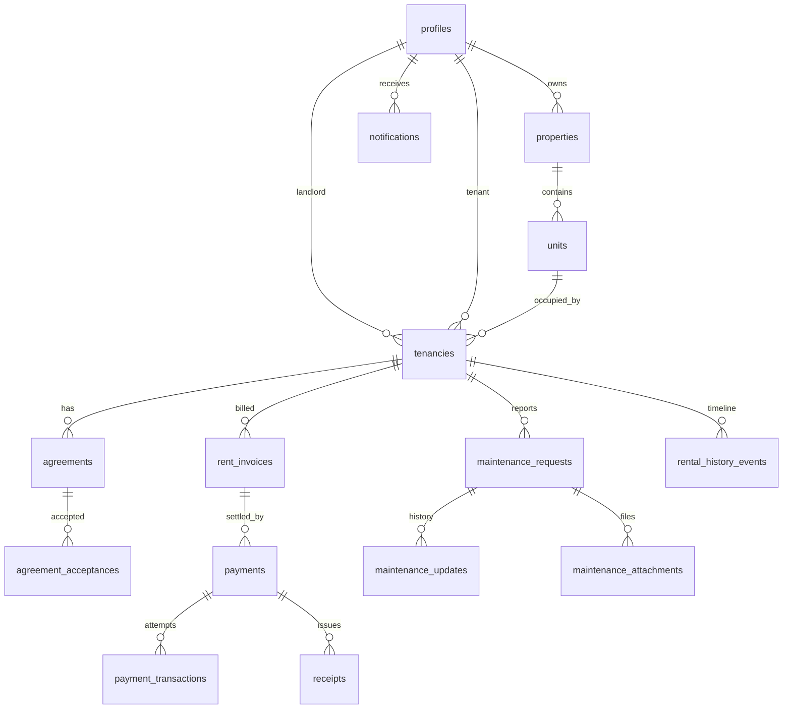

# Database Schema — RentFlow

This document is the **planned** relational model. No production schema has been migrated yet. Implement via SQL migrations in `supabase/migrations/` when Phase 1+ begins.

Prefer a single `profiles` row per auth user with a role (or roles) rather than duplicated landlord/tenant user tables.

## Entity overview

## profiles

**Purpose:** Application identity linked to Supabase Auth `auth.users`.

Conceptual columns: `id` (PK, auth user id), `full_name`, `phone`, `role` (`landlord` | `tenant` | `property_manager`), `locale`, `created_at`, `updated_at`.

Constraints: unique phone when present; role check constraint.

Indexes: `phone`, `role`.

Lifecycle: created on first successful signup.

RLS: users read/update their own profile; landlords may read tenant profiles only for tenancies they own.

## properties

Landlord-owned buildings or plots. Columns: `id`, `landlord_id`, `name`, `address_line`, `ward`, `district`, `region`, `created_at`.

Indexes: `landlord_id`.

RLS: landlord owns rows; tenants read only properties linked through active tenancy.

## units

Rentable houses, apartments, rooms, or units. Columns: `id`, `property_id`, `label`, `unit_type`, `monthly_rent_tzs`, `deposit_tzs`, `billing_frequency`, `is_occupied`, `created_at`.

Indexes: `property_id`.

## tenancies

Relationship between landlord, tenant, and unit. Columns: `id`, `property_id`, `unit_id`, `landlord_id`, `tenant_id`, `start_date`, `end_date`, `status`, `created_at`.

Constraints: tenant and landlord must differ; unit belongs to property.

## agreements

Structured snapshot of tenancy terms. Columns: `id`, `tenancy_id`, `version`, `status`, `rent_tzs`, `deposit_tzs`, `billing_frequency`, `payment_day`, `start_date`, `end_date`, `terms`, `additional_clauses`, `created_at`.

Lifecycle: DRAFT → SENT → VIEWED → ACCEPTED → ACTIVE → EXPIRED | TERMINATED | RENEWED.

## agreement_acceptances

Audit of acceptance. Columns: `id`, `agreement_id`, `agreement_version`, `accepted_by`, `accepted_at`, `ip_metadata` (optional), `user_agent` (optional).

Do not treat this row as automatic legal e-signature certification.

## rent_invoices

Obligations independent of payments. Columns: `id`, `tenancy_id`, `amount_tzs`, `period_start`, `period_end`, `due_date`, `status`, `amount_paid_tzs`, `balance_tzs`, `created_at`.

Statuses: DRAFT, UPCOMING, DUE, PARTIALLY_PAID, PAID, OVERDUE, WAIVED, CANCELLED.

Indexes: `tenancy_id`, `due_date`, `status`.

## payments

Logical payment against one or more allocations (MVP: one invoice). Columns: `id`, `invoice_id`, `payer_id`, `amount_tzs`, `currency`, `provider`, `status`, `provider_reference`, `initiated_at`, `completed_at`.

Statuses: CREATED, PENDING, PROCESSING, SUCCESSFUL, FAILED, CANCELLED, REVERSED.

## payment_transactions

Provider attempts / callbacks. Columns: `id`, `payment_id`, `provider`, `provider_transaction_id`, `status`, `raw_payload` (sanitized), `created_at`.

Unique: `(provider, provider_transaction_id)` when present (idempotency).

## receipts

Columns: `id`, `payment_id`, `invoice_id`, `issued_at`, `receipt_number`.

## maintenance_requests

Columns: `id`, `tenancy_id`, `created_by`, `category`, `title`, `description`, `priority`, `status`, `created_at`.

Categories and statuses match `src/types/domain.ts`.

## maintenance_updates

Columns: `id`, `request_id`, `actor_id`, `from_status`, `to_status`, `note`, `created_at`.

## maintenance_attachments

Columns: `id`, `request_id`, `storage_path`, `content_type`, `created_at`.

## notifications

Columns: `id`, `user_id`, `channel`, `template_id`, `payload`, `status`, `sent_at`, `created_at`.

## rental_history_events

Immutable-style timeline. Columns: `id`, `tenancy_id`, `event_type`, `payload`, `occurred_at`, `actor_id`.

Insert-only in application code; updates/deletes restricted.

## Enums

Align application unions in `src/types/domain.ts` with Postgres enums or check constraints. Prefer check constraints until enums stabilize.

## RLS expectations

Mandatory before production:

- Tenant cannot read other tenants’ tenancies, invoices, or passports.
- Landlord cannot read properties they do not own.
- Service role used only in trusted server jobs.
- Storage objects owned through tenancy membership.

## Auditability

Acceptance, payment transactions, maintenance updates, and timeline events are the audit spine. Prefer append-only history for money and status changes.

## Current implementation

No tables have been created in this repository bootstrap.
